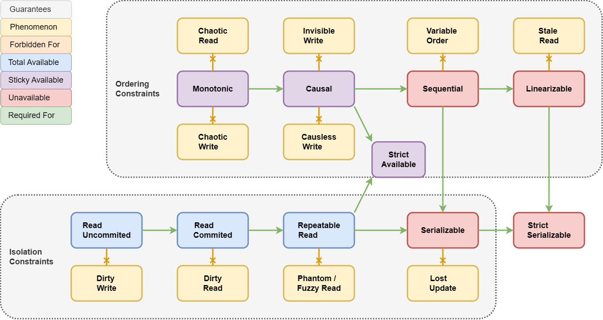

# Giper Baza

> 💡 Decentralized high-available database with conflict-free real-time synchronization.

- **Convergent**: CvRDT, Total-Ordered, Interleaving-Free, Weak-Typed
- **Realtime**: Delta-Replication, WebSocket/🔜WebRTC, Instant-Start
- **Unbreakable**: High-Availability, Partition-Tolerance, Auto-Recovery
- **Secure**: Digital-Signature, End-to-End Encryption, Encrypted-Merge, Zero-Trust
- **Decentralized**: Local-First, Simple-Smart-Contract, 🔜Peer-to-Peer
- **Brilliant**: Reactive-Architecture, Clustered-Graph-Model, First Class ISO8601/JSON/DOM/Tree

## Guarantees

**Strict Availability** - most strict partition tolerant guarantee. Forbidden phenomenons:
  - **Chaotic Read/Write** - violation of the operations sequence.
  - **Invisible/Causless Write** - violation of operations causality.
  - **Dirty Read/Write** - violation of transaction atomicity.
  - **Phantom/Fuzzy Read** - violation of operation idempotence.



## Vocabulary

- **🌌Glob** - Whole global graph database which contains Lands.
- **🌍Land** - Standalone part of Glob which syncs separately, have own rights, and contains Units.
  - **🏠Home** - Land where Lord is King. Contains only main info.
    - **🎶Hall** - Lord's profile with full info.
- **Lord** - Independent actor with global unique id generated from Auth key.
  - **🤴King** - Lord who have full rights to Land (with same id).
- **Area** - Sub Land.
  - **Data** - some stored data.
  - **Tine** - inflow lands.

- **Auth** - Private key generated with Proof of Work.
- **Peer** - Land local unique identifier of independent actor (first half of Lord).
- **Sign** - Crypto sign of whole Unit data xored with Land id.

- **🧩Pawn** - High level representation of stored data.
  - **Atom** - Atomic LWW-register.
  - **List** - Mergeable ordered list.
  - **Dict** - Mergeable ordered dictionary.
  - **Text** - Mergeable plain text.
  - **DOM** - Mergeable Document Object Model.
  - **Tree** - Mergeable Abstract Syntax Tree.

- **Unit** - Minimal independent stable part of information. Actually it's edge between Pawns in graph model.
  - **🎫Pass** - Public key of Peer.
  - **🏅Give** - Rights and secret key given to Peer.
  - **📦Sand** - (Meta) Data.
  - **✍Seal** - Signature for units.

- **🆔Self** - Self Pawn id
- **🎃Head** - Parent Pawn id.
- **😎Lead** - Previous Pawn id in the siblings list.
- **💺Seat** - Position in the list.
- **🎭Tag** - Hint how interpret inner Units.
  - **💼term** - ignore.
  - **🔝solo** - ignore all after first.
  - **🎹vals** - list of values.
  - **🔑keys** - list of keys.

- **Time** - Monotonic time as count of seconds from unix epoch.
- **Tick** - Monotonic counter of units in one transaction.
- **Data** - Stored data.
- **💎Shot** - First 12B of SHA-1 hash.
- **🎡Vary** - Supported primitive types.
  - **💢none** - No data.
  - **💠blob** - Binary.
  - **🏁bool** - Boolean.
  - **🔢bint** - int64.
  - **💫real** - float64.
  - **🎯link** - Reference to Pawn/Land/Lord.
  - **🔠text** - String.
  - **⏰time** - iso8601 moment.
  - **🕓dura** - iso8601 duration.
  - **🎬span** - iso8601 range.
  - **📚list** - array of any type.
  - **📖tupl** - tuple of named values.
  - **🛐elem** - Element of Document Object Model (xml, xhtml etc).
  - **🌴tree** - Abstract Syntax Tree.

- **Rank** - Access level.
  - **🛑deny** - Forbidden.
  - **👀read** - Read only.
  - **✍post** - Change data
  - **🥂pull** - Merge lands.
  - **👑rule** - Full access.

- **Mine** - Units/Rocks storage.
- **Yard** - Glob synchronizer.
- **Port** - Communication link with other peer.
- **Diff** - Difference of two Land states as list of Units.
- **Face** - Statistics about Units in Land. it's total Units count & dictionary which maps Peer to Time.
- **Pack** - Universal binary package which contains some Faces/Units/Rocks.

- **Token** - Minimal meaningful part of text (space + single word / spaces / punctuation etc).
- **Point** - Place inside Unit. Useful for caret position.
- **Range** - Range between two Points. Useful for selection.
- **Offset** - Count of letters from beginning.

- **Channel** - Getter/Setter method. `foo()` - read. `foo(123)` - write and return written.

- **Flex** - User interface which formed by Deck.
  - **Pawn** - Base entity.
  - **Meta** - Entity schema.
  - **Prop** - Property schema.
  - **Deck** - Set of Metas, Props, and Types.

## TypeScript API

### Entity Models

```ts
/** Organ Model */
export class $my_organ extends $giper_baza_entity.with({
	// Title: $giper_baza_atom_text, - inherited from $giper_baza_entity
	Critical: $giper_baza_atom_bool, // atomic boolean
	Count: $giper_baza_atom_blob, // atomic big integer
	Weight: $giper_baza_atom_real, // atomic double size float
	Photo: $giper_baza_atom_blob, // atomic blob
	Description: $giper_baza_text, // mergeable long text
	Contains: $giper_baza_list_link.to( ()=> $my_organ ), // reference to same Model type
}) {}

/** Sex Model */
export class $my_sex extends $giper_baza_atom_enum([ 'male', 'female' ]) {}  // atomic enumerated value

/** Person Model */
export class $my_person extends $giper_baza_entity.with({
	// Title: $giper_baza_atom_text, - inherited from $giper_baza_entity
	Birthday: $giper_baza_atom_time, // atomic time moment
	Sex: $my_sex, // narrowed custom type
	Heart: $my_organ, // embedded Model
	Parent: $giper_baza_atom_link.to( ()=> $my_person ), // reference to Model
	Kids: $giper_baza_list_link.to( ()=> $my_person ), // list of references to Models
	/** @deprecated Use Parent */ Father: $giper_baza_atom_link.to( ()=> $my_person ),
}) {
	
	// Alias with custom logic
	sex( next?: typeof $my_sex.options[number] ) {
		return this.Sex( next )?.val( next ) ?? 'male'
	}
	
	// Fallback to old field
	parent( next?: $my_person | null ) {
		return this.Parent( next )?.remote( next ) ?? this.Father()?.remote() ?? null
	}
	
}
```

### Glob Usage

```ts
/** Application, component etc */
export class $my_app extends $mol_object {

	// Whole database
	@ $mol_mem
	glob() {
		return new $giper_baza_glob
	}
	
	// Current user profile for current application
	@ $mol_mem
	hall() {
		return this.glob().home().hall_by( $my_person, $giper_baza_rank_public )
	}
	
	// Use existing entity by reference
	@ $mol_mem_key
	person( ref: $giper_baza_link ) {
		return this.glob().Pawn( ref, $my_person )
	}
	
	// Add new linked entity
	@ $mol_action
	kid_add( name: string ) {
		
		const me = this.hall()
		
		// Populate external entity
		const kid = me.Kids(null)!.remote_make( $giper_baza_rank_public )
		kid.Parent(null)!.remote( me )
		
		// Fill self fields
		kid.Title(null)!.val( name )
		kid.Birthday(null)!.val( new $mol_time_moment( '1984-08-04' ) )
		kid.Sex(null)!.val( 'male' )
		
		// Fill embedded entities
		const heart = kid.Heart(null)!
		heart.Critical(null)!.val( true )
		heart.Count(null)!.val( 1n )
		heart.Weight(null)!.val( 1.4 )
		heart.Description(null)!.text( 'Pumps blood!' )
		
		return kid
	}
	
}
```

## Types

### Unit

Юнит - минимальный кирпичик состояния. Каждый юнит позиционируется относительно head (по вертикали) и lead (по горизонтали) юнитов и имеет один из четырёх тегов:

- **T**erm - просто содержит данные. Вложенные юниты не предполагаются.
- **V**als - содержит список значений, где каждый вложенный юнит отвечает за элемент списка.
- **S**olo - регистр, хранящий данные в первом вложенном юните.
- **K**eys - содержит список ключей, где каждый вложенный юнит отвечает за элемент списка.


- `$giper_baza_auth_pass` - public key
- `$giper_baza_unit_gift` - given rank and secret
- `$giper_baza_unit_sand` - data
- `$giper_baza_unit_seal` - signature

### Atomic LWW-Register

Атомарный регистр - хранит одно последнее установленное значение. Если базе актуально находится несколько юнитов, то работает с первым из них.


- `$giper_baza_atom` - atomic register
- `$giper_baza_atom_blob` - atomic non empty binary register
- `$giper_baza_atom_bool` - atomic boolean register
- `$giper_baza_atom_blob` - atomic int64 register
- `$giper_baza_atom_real` - atomic float64 register
- `$giper_baza_atom_link` - atomic link to pawn register
- `$giper_baza_atom_text` - atomic string register
- `$giper_baza_atom_time` - atomic iso8601 time moment register
- `$giper_baza_atom_dura` - atomic iso8601 time duration register
- `$giper_baza_atom_span` - atomic iso8601 time interval register
- `$giper_baza_atom_json` - atomic plain old js object register
- `$giper_baza_atom_jsan` - atomic plain old js array register
- `$giper_baza_atom_elem` - atomic DOM register
- `$giper_baza_atom_tree` - atomic Tree register

### Ordered List

Список значений может работать и как упорядоченное множество при использовании соответствующих методов.


- `$giper_baza_list` - mergeable list of atomic vary type factory
- `$giper_baza_list_vary` - mergeable list of atomic vary types
- `$giper_baza_list_blob` - mergeable list of atomic non empty binaries
- `$giper_baza_list_bool` - mergeable list of atomic booleans
- `$giper_baza_list_blob` - mergeable list of atomic int64s
- `$giper_baza_list_real` - mergeable list of atomic float64s
- `$giper_baza_list_link` - mergeable list of atomic links to pawns
- `$giper_baza_list_text` - mergeable list of atomic strings
- `$giper_baza_list_time` - mergeable list of atomic iso8601 time moments
- `$giper_baza_list_dura` - mergeable list of atomic iso8601 time durations
- `$giper_baza_list_span` - mergeable list of atomic iso8601 time intervals
- `$giper_baza_list_json` - mergeable list of atomic plain old js objects
- `$giper_baza_list_jsan` - mergeable list of atomic plain old js arrays
- `$giper_baza_list_elem` - mergeable list of atomic DOMs
- `$giper_baza_list_tree` - mergeable list of atomic Trees

### Ordered Dictionary

Словарь актуально является упорядоченным множеством ключей, внутри каждого из которых хранится произвольный тип данных.


- `$giper_baza_dict` - mergeable dictionary Pawn with any keys mapped to any embedded Pawn types
- `$giper_baza_dict_to` - mergeable dictionary Pawn with any keys mapped to some embedded Pawn type
- `$giper_baza_dict.with` - mergeable dictionary Pawn with defined keys mapped to different embedded Pawn types

### Tree


### Plain Text

Плоский текст является списком параграфов, каждый из которых хранит список токенов. Является частным случаем DOM.


- `$giper_baza_text` - mergeable text Pawn

### DOM


### JSON


## Rights

Всего есть 5 уровней прав:

- **🛑deny** - нет доступа, ни на чтение, ни на запись.
- **👀read** - можно только читать.
- **✍post** - можно читать и писать данные.
- **🥂pull** - можно читать и писать любые данные и метаданные.
- **👑rule** - полный доступ, включая раздачу прав.

Права можно выдавать либо конкретному пиру (по идентификатору лорда), либо вообще всем (пустой идентификатор). При захвате ленда указываются базовый набор прав - стоит настраивать его внимательно.

Если всем не дать право на чтение, то ленд будет автоматически зашифрован. При выдаче прав, пиру передаётся также и секретный ключ шифрования, который шифруется взаимным ключом для выдающего права и принимающего их. При понижении прав, удаляются и все внесённые пиром изменения, которые больше не проходят по правам. Если данные при этом нужно сохранить, то их необходимо внести заново уже от своего имени.

Важно отметить, что даже если вы забрали право на чтение, пользователь мог сохранить себе данные или ключ шифрования, когда у него доступ был. Так что не стоит сильно рассчитывать на отзыв права на чтение - нужно внимательно следить какие и кому данные вы раскрываете.

## Synchronization Protocol

Сперва два пира обмениваются фейсами (что-то типа "векторных часов"), которые позволяют понять, каких юнитов не хватает партнёру. Далее они докидывают друг другу недостающие юниты по мере их появления. Подтверждение приёма не требуется - полагаемся на транспортный уровень, гарантирующий либо доставку, либо обрыв соединения с последующим реконнектом, обменом фейсами и тд.


### Pack

Пакет состоит из произвольного числа частей разных типов. Пакет может передаваться как сообщение другому пиру, может сохраняться в файл. И даже СУБД может хранить данные в том же самом формате.


# Common Scenarios

## Authentification

### Auto Sign Up/In

Для цифровых подписей и шифрования у нас используется приватный ключ, который хранится в локальном хранилище браузера. Строит открыть приложения - пользователь уже "зарегистрирован" и может им пользоваться. Для смены пользователя достаточно поменять ключ в локальном хранилище. Но более безопасно разным пользователям использовать разные системные учётные записи и не жонглировать приватными ключами.

Приватный ключ может быть зашифрован секретным паролем и выдан пользователю в виде ссылки, которую он может сохранить в надёжное место (рекомендуется на случай очистки локального хранилища браузером) или открыть на другом девайсе (чтобы иметь одни и те же доступы с разных устройств). Если в форму по такой ссылке ввести тот же пароль, то ключ будет расшифрован и помещён в локальное хранилище.

Таким образом приватный ключ никогда не попадает на сервер и не передаётся по сети в незашифрованном виде. 

### Login-Password Based

Более традиционная схема с логинами-паролями менее безопасна, так как пользователи часто устанавливают слабый пароль или записывают его на бумажке, от чего появляется возможность кому угодно его подбирать. Тем не менее, реализуется она так: приватный ключ шифруется паролем и кладётся в базу (обычно в профиль пользователя или в отдельный ленд со словарём "логин-ключ").

При авторизации по логину находится зашифрованный ключ, который расшифровывается паролем и кладётся в локальное хранилище. Для "выхода" ключ просто стирается из локального хранилища. Этого достаточно, так как все приватные данные в базе хранятся в зашифрованном виде.

## Exactly-Once Proceed

Пусть у нас есть множество серверов (обработчиков), которые разгребают неидемпотентные задачи (например, отсылают письма из базы). С одной стороны мы хотим, чтобы все письма были доставлены. С другой - чтобы не задублировались. Между началом и концом у задачи есть "точка невозврата", когда её уже невозможно отменить. Доступность, очевидно, конфликтует с отсутствием дубликатов, так как два обработчика без контакта друг с другом могут взяться за одну задачу и не узнать об этом до точки невозврата, что за задачу взялся ещё и другой обработчик. А попытка решить этот вопрос обязательным консенсусом сломает доступность при частичном разделении сети.

### High Availability

Применяется стратегия вежливого оптимизма, которая лишь изредка будет давать дублирование задачи:

- Клиент создаёт задачу в своей локальной базе.
- База синхронизируется с обработчиками.
- Обработчик видит новую задачу и начинает обработку, чекинясь в задаче.
- База синхронизируется между обработчиками.
- Если обработчик видит, что другой обработчик зачекинился раньше, то отменяет задачу.
- Перед обработкой задачи вставляется небольшая задержка на синхронизацию базы.
- Падение обработчика приводит к его перезапуску и продолжению обработки задачи.
- Если задача не обработана за определённый срок, то любой обработчик может её перехватить на себя.
- По завершению, обработчик пишет в задачу резолюцию.
- База синхронизируется с клиентом и он видит её статус.

### Prevent Doubling

Применяется стратегия шардирования по идентификатору:

- Клиент создаёт задачу в своей локальной базе.
- База синхронизируется с обработчиками.
- За каждым диапазоном идентификаторов задач закреплён свой обработчик.
- Обработчик разгребает задачи по мере их поступления.
- Падение обработчика или отсутствие связи с ним приводит к остановке обработки лишь его задач.
- Балансировка осуществляется за счёт случайной генерации идентификаторов задач.
- Изменение состава обработчиков осуществляется путём освобождения диапазонов идентификаторов одними обработчиками с последующей регистрацией на них других.

## Global Index

### Local Index

Так как на каждом узле в общем случае есть только часть всей базы, то локальный индекс не сможет найти то, что никогда не синхронизировалось. Зато локальный индекс можно строить и по приватным данным.

### Shared Index

Создаётся дерево лендов с правами на добавление всем кто обновляет индексируемые данные, каждый из которых, обновляя данные, автоматически обновляет и индекс. Позволяет не скачивать себе весь индекс, но этот подход подвержен спаму, поэтому требуется доп фильтрация результатов поиска.

### Index Service

Отдельный микросервис, который синхронизирует все данные и обновляет индексное дерево лендов. Требуется доверие этому микросервису. В общем случае он не может индексировать приватные данные, если ему не дать на них доступ, что не безопасно.

# Векторы развития

## Sharding

Сейчас вся база реплицируется через все сервера. Это ограничивает масштабирование. Однако, можно в зависимости от идентификатора ленда синхронизировать его через разные кластеры серверов, не синхронизирующеся между собой. Это позволит горизонтально масштабироваться практически неограниченно. Каждому клиенту при этом нужно будет поддерживать соединение с одним сервером из каждого кластера.
